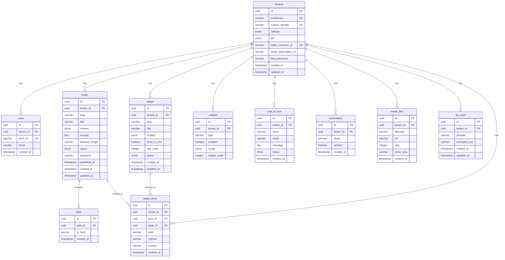

# Pint - Entity Relationship Diagram (ERD)

**Version:** 1.0
**Date:** January 2026

---

## Table of Contents

1. [Overview](#1-overview)
2. [ERD Diagram (Mermaid)](#2-erd-diagram-mermaid)
3. [Entity Definitions](#3-entity-definitions)
4. [Relationships](#4-relationships)
5. [Indexes](#5-indexes)
6. [Constraints](#6-constraints)
7. [Data Types Reference](#7-data-types-reference)
8. [Migration Strategy](#8-migration-strategy)

---

## 1. Overview

### 1.1 Entity Summary

| Entity | Description | Multi-Tenant |
|--------|-------------|--------------|
| `tenants` | Blog/site instances | Root entity |
| `users` | Creator accounts (linked to Clerk) | Yes |
| `posts` | Blog post content | Yes |
| `pages` | Static page content | Yes |
| `widgets` | Widget configurations | Yes |
| `likes` | Post likes/reactions | Via post |
| `wall_of_love` | Reader testimonials | Yes |
| `subscribers` | Newsletter subscribers | Yes |
| `media_files` | Uploaded media tracking | Yes |
| `api_keys` | BYOK API keys (encrypted) | Yes |
| `page_views` | Analytics data | Yes |

### 1.2 Design Principles

1. **UUID Primary Keys** - All tables use UUID v4 for primary keys
2. **Tenant Isolation** - Every tenant-owned table has `tenant_id` foreign key
3. **Soft Timestamps** - `created_at` and `updated_at` on all tables
4. **JSONB for Flexibility** - Dynamic configs stored as JSONB
5. **Composite Indexes** - All queries start with `tenant_id`

---

## 2. ERD Diagram (Mermaid)



---

## 3. Entity Definitions

### 3.1 tenants

The root entity representing a blog/site instance.

```sql
CREATE TABLE tenants (
    id              UUID PRIMARY KEY DEFAULT gen_random_uuid(),
    subdomain       VARCHAR(30) NOT NULL UNIQUE,
    custom_domain   VARCHAR(255) UNIQUE,
    settings        JSONB NOT NULL DEFAULT '{}',
    tier            VARCHAR(20) NOT NULL DEFAULT 'free'
                    CHECK (tier IN ('free', 'pro', 'max', 'lifetime')),

    -- Stripe integration
    stripe_customer_id      VARCHAR(255) UNIQUE,
    stripe_subscription_id  VARCHAR(255),

    -- Password protection
    blog_password   VARCHAR(255),

    -- Timestamps
    created_at      TIMESTAMP WITH TIME ZONE NOT NULL DEFAULT NOW(),
    updated_at      TIMESTAMP WITH TIME ZONE NOT NULL DEFAULT NOW()
);

-- Settings JSONB structure example:
-- {
--   "title": "My Blog",
--   "description": "A blog about things",
--   "language": "en",
--   "defaultTheme": "light",
--   "defaultFont": "inter",
--   "defaultFontSize": "medium",
--   "seoEnabled": true,
--   "robotsIndexing": true,
--   "likesEnabled": true,
--   "likesPublic": true,
--   "rssFullContent": true,
--   "rssItemCount": 25,
--   "analyticsEnabled": true,
--   "externalAnalyticsScript": null,
--   "homepageContent": {...} -- Tiptap JSON for homepage header
-- }
```

| Column | Type | Nullable | Default | Description |
|--------|------|----------|---------|-------------|
| id | UUID | No | gen_random_uuid() | Primary key |
| subdomain | VARCHAR(30) | No | - | Unique subdomain (e.g., "johndoe") |
| custom_domain | VARCHAR(255) | Yes | NULL | Custom domain (e.g., "blog.example.com") |
| settings | JSONB | No | '{}' | Blog settings and configuration |
| tier | VARCHAR(20) | No | 'free' | Subscription tier |
| stripe_customer_id | VARCHAR(255) | Yes | NULL | Stripe customer ID |
| stripe_subscription_id | VARCHAR(255) | Yes | NULL | Active subscription ID |
| blog_password | VARCHAR(255) | Yes | NULL | Blog-level password (hashed) |
| created_at | TIMESTAMPTZ | No | NOW() | Creation timestamp |
| updated_at | TIMESTAMPTZ | No | NOW() | Last update timestamp |

---

### 3.2 users

Creator accounts linked to Clerk authentication.

```sql
CREATE TABLE users (
    id          UUID PRIMARY KEY DEFAULT gen_random_uuid(),
    tenant_id   UUID NOT NULL REFERENCES tenants(id) ON DELETE CASCADE,
    clerk_id    VARCHAR(255) NOT NULL UNIQUE,
    email       VARCHAR(255) NOT NULL,

    created_at  TIMESTAMP WITH TIME ZONE NOT NULL DEFAULT NOW()
);

CREATE INDEX idx_users_tenant_id ON users(tenant_id);
```

| Column | Type | Nullable | Default | Description |
|--------|------|----------|---------|-------------|
| id | UUID | No | gen_random_uuid() | Primary key |
| tenant_id | UUID | No | - | Reference to tenant |
| clerk_id | VARCHAR(255) | No | - | Clerk user ID |
| email | VARCHAR(255) | No | - | User email |
| created_at | TIMESTAMPTZ | No | NOW() | Creation timestamp |

---

### 3.3 posts

Blog post content with Tiptap JSON storage.

```sql
CREATE TABLE posts (
    id              UUID PRIMARY KEY DEFAULT gen_random_uuid(),
    tenant_id       UUID NOT NULL REFERENCES tenants(id) ON DELETE CASCADE,
    slug            VARCHAR(255) NOT NULL,
    title           VARCHAR(200) NOT NULL,
    content         JSONB NOT NULL,
    excerpt         TEXT,
    featured_image  VARCHAR(2048),
    status          VARCHAR(20) NOT NULL DEFAULT 'draft'
                    CHECK (status IN ('draft', 'published')),
    password        VARCHAR(255),  -- Per-post password (hashed)

    published_at    TIMESTAMP WITH TIME ZONE,
    created_at      TIMESTAMP WITH TIME ZONE NOT NULL DEFAULT NOW(),
    updated_at      TIMESTAMP WITH TIME ZONE NOT NULL DEFAULT NOW(),

    UNIQUE(tenant_id, slug)
);

CREATE INDEX idx_posts_tenant_status ON posts(tenant_id, status);
CREATE INDEX idx_posts_tenant_published ON posts(tenant_id, published_at DESC);
CREATE INDEX idx_posts_published_at ON posts(published_at DESC) WHERE status = 'published';

-- Content JSONB structure (Tiptap format):
-- {
--   "type": "doc",
--   "content": [
--     {
--       "type": "heading",
--       "attrs": { "level": 1 },
--       "content": [{ "type": "text", "text": "Hello World" }]
--     },
--     {
--       "type": "paragraph",
--       "content": [{ "type": "text", "text": "This is my first post." }]
--     },
--     {
--       "type": "image",
--       "attrs": {
--         "src": "https://media.pint.im/...",
--         "alt": "Description",
--         "title": "Image title"
--       }
--     }
--   ]
-- }
```

| Column | Type | Nullable | Default | Description |
|--------|------|----------|---------|-------------|
| id | UUID | No | gen_random_uuid() | Primary key |
| tenant_id | UUID | No | - | Reference to tenant |
| slug | VARCHAR(255) | No | - | URL slug |
| title | VARCHAR(200) | No | - | Post title |
| content | JSONB | No | - | Tiptap JSON content |
| excerpt | TEXT | Yes | NULL | Post excerpt/summary |
| featured_image | VARCHAR(2048) | Yes | NULL | Featured image URL |
| status | VARCHAR(20) | No | 'draft' | Publication status |
| password | VARCHAR(255) | Yes | NULL | Post-specific password |
| published_at | TIMESTAMPTZ | Yes | NULL | Publication date |
| created_at | TIMESTAMPTZ | No | NOW() | Creation timestamp |
| updated_at | TIMESTAMPTZ | No | NOW() | Last update timestamp |

---

### 3.4 pages

Static pages with same Tiptap content structure.

```sql
CREATE TABLE pages (
    id          UUID PRIMARY KEY DEFAULT gen_random_uuid(),
    tenant_id   UUID NOT NULL REFERENCES tenants(id) ON DELETE CASCADE,
    slug        VARCHAR(255) NOT NULL,
    title       VARCHAR(200) NOT NULL,
    content     JSONB NOT NULL,
    show_in_nav BOOLEAN NOT NULL DEFAULT true,
    nav_order   INTEGER,
    status      VARCHAR(20) NOT NULL DEFAULT 'draft'
                CHECK (status IN ('draft', 'published')),

    created_at  TIMESTAMP WITH TIME ZONE NOT NULL DEFAULT NOW(),
    updated_at  TIMESTAMP WITH TIME ZONE NOT NULL DEFAULT NOW(),

    UNIQUE(tenant_id, slug)
);

CREATE INDEX idx_pages_tenant_status ON pages(tenant_id, status);
CREATE INDEX idx_pages_tenant_nav ON pages(tenant_id, show_in_nav, nav_order);
```

| Column | Type | Nullable | Default | Description |
|--------|------|----------|---------|-------------|
| id | UUID | No | gen_random_uuid() | Primary key |
| tenant_id | UUID | No | - | Reference to tenant |
| slug | VARCHAR(255) | No | - | URL slug |
| title | VARCHAR(200) | No | - | Page title |
| content | JSONB | No | - | Tiptap JSON content |
| show_in_nav | BOOLEAN | No | true | Show in navigation |
| nav_order | INTEGER | Yes | NULL | Navigation order |
| status | VARCHAR(20) | No | 'draft' | Publication status |
| created_at | TIMESTAMPTZ | No | NOW() | Creation timestamp |
| updated_at | TIMESTAMPTZ | No | NOW() | Last update timestamp |

---

### 3.5 widgets

Widget configurations per tenant.

```sql
CREATE TABLE widgets (
    id              UUID PRIMARY KEY DEFAULT gen_random_uuid(),
    tenant_id       UUID NOT NULL REFERENCES tenants(id) ON DELETE CASCADE,
    type            VARCHAR(50) NOT NULL,
    enabled         BOOLEAN NOT NULL DEFAULT false,
    config          JSONB NOT NULL DEFAULT '{}',
    display_order   INTEGER NOT NULL DEFAULT 0
);

CREATE INDEX idx_widgets_tenant ON widgets(tenant_id);
CREATE INDEX idx_widgets_tenant_enabled ON widgets(tenant_id, enabled);

-- Config JSONB structure varies by widget type:

-- Theme Switcher:
-- {
--   "availableThemes": ["light", "dark", "sepia"],
--   "defaultTheme": "light",
--   "allowSwitching": true
-- }

-- Font Customizer:
-- {
--   "availableFonts": ["inter", "georgia", "mono"],
--   "availableSizes": ["small", "medium", "large", "xlarge"],
--   "defaultFont": "inter",
--   "defaultSize": "medium"
-- }

-- Music Player:
-- {
--   "tracks": [
--     {
--       "id": "uuid",
--       "title": "Track Name",
--       "artist": "Artist Name",
--       "url": "https://media.pint.im/...",
--       "duration": 180
--     }
--   ],
--   "defaultVolume": 50,
--   "loop": true,
--   "visualStyle": "minimal" -- "minimal", "waveform", "album"
-- }

-- Poll (Phase 2):
-- {
--   "question": "What's your favorite feature?",
--   "options": ["Editor", "Widgets", "AI"],
--   "showResults": "after_vote", -- "always", "after_vote", "never"
--   "expiresAt": "2026-02-01T00:00:00Z"
-- }
```

| Column | Type | Nullable | Default | Description |
|--------|------|----------|---------|-------------|
| id | UUID | No | gen_random_uuid() | Primary key |
| tenant_id | UUID | No | - | Reference to tenant |
| type | VARCHAR(50) | No | - | Widget type identifier |
| enabled | BOOLEAN | No | false | Is widget enabled |
| config | JSONB | No | '{}' | Widget configuration |
| display_order | INTEGER | No | 0 | Display order in stack |

**Widget Types:**
- `theme_switcher`
- `font_customizer`
- `music_player`
- `poll` (Phase 2)
- `wall_of_love` (Phase 2)
- `activity_chart` (Phase 2)

---

### 3.6 likes

Anonymous post likes tracked by IP hash.

```sql
CREATE TABLE likes (
    id          UUID PRIMARY KEY DEFAULT gen_random_uuid(),
    post_id     UUID NOT NULL REFERENCES posts(id) ON DELETE CASCADE,
    ip_hash     VARCHAR(64) NOT NULL,  -- SHA-256 of IP

    created_at  TIMESTAMP WITH TIME ZONE NOT NULL DEFAULT NOW(),

    UNIQUE(post_id, ip_hash)
);

CREATE INDEX idx_likes_post ON likes(post_id);
CREATE INDEX idx_likes_created ON likes(created_at);
```

| Column | Type | Nullable | Default | Description |
|--------|------|----------|---------|-------------|
| id | UUID | No | gen_random_uuid() | Primary key |
| post_id | UUID | No | - | Reference to post |
| ip_hash | VARCHAR(64) | No | - | SHA-256 hash of IP |
| created_at | TIMESTAMPTZ | No | NOW() | Like timestamp |

---

### 3.7 wall_of_love

Reader testimonials awaiting moderation.

```sql
CREATE TABLE wall_of_love (
    id          UUID PRIMARY KEY DEFAULT gen_random_uuid(),
    tenant_id   UUID NOT NULL REFERENCES tenants(id) ON DELETE CASCADE,
    name        VARCHAR(100) NOT NULL,
    email       VARCHAR(255) NOT NULL,
    message     TEXT NOT NULL,
    avatar_url  VARCHAR(2048),
    status      VARCHAR(20) NOT NULL DEFAULT 'pending'
                CHECK (status IN ('pending', 'approved', 'rejected')),

    created_at  TIMESTAMP WITH TIME ZONE NOT NULL DEFAULT NOW()
);

CREATE INDEX idx_wall_of_love_tenant_status ON wall_of_love(tenant_id, status);
CREATE INDEX idx_wall_of_love_tenant_approved ON wall_of_love(tenant_id, created_at DESC)
    WHERE status = 'approved';
```

| Column | Type | Nullable | Default | Description |
|--------|------|----------|---------|-------------|
| id | UUID | No | gen_random_uuid() | Primary key |
| tenant_id | UUID | No | - | Reference to tenant |
| name | VARCHAR(100) | No | - | Submitter name |
| email | VARCHAR(255) | No | - | Submitter email |
| message | TEXT | No | - | Testimonial message |
| avatar_url | VARCHAR(2048) | Yes | NULL | Optional avatar |
| status | VARCHAR(20) | No | 'pending' | Moderation status |
| created_at | TIMESTAMPTZ | No | NOW() | Submission timestamp |

---

### 3.8 subscribers

Newsletter subscribers (for Phase 2).

```sql
CREATE TABLE subscribers (
    id          UUID PRIMARY KEY DEFAULT gen_random_uuid(),
    tenant_id   UUID NOT NULL REFERENCES tenants(id) ON DELETE CASCADE,
    email       VARCHAR(255) NOT NULL,
    verified    BOOLEAN NOT NULL DEFAULT false,

    created_at  TIMESTAMP WITH TIME ZONE NOT NULL DEFAULT NOW(),

    UNIQUE(tenant_id, email)
);

CREATE INDEX idx_subscribers_tenant ON subscribers(tenant_id);
CREATE INDEX idx_subscribers_tenant_verified ON subscribers(tenant_id, verified);
```

| Column | Type | Nullable | Default | Description |
|--------|------|----------|---------|-------------|
| id | UUID | No | gen_random_uuid() | Primary key |
| tenant_id | UUID | No | - | Reference to tenant |
| email | VARCHAR(255) | No | - | Subscriber email |
| verified | BOOLEAN | No | false | Email verified |
| created_at | TIMESTAMPTZ | No | NOW() | Subscription timestamp |

---

### 3.9 media_files

Tracks uploaded media files.

```sql
CREATE TABLE media_files (
    id          UUID PRIMARY KEY DEFAULT gen_random_uuid(),
    tenant_id   UUID NOT NULL REFERENCES tenants(id) ON DELETE CASCADE,
    filename    VARCHAR(255) NOT NULL,
    url         VARCHAR(2048) NOT NULL,
    size        INTEGER NOT NULL,  -- Bytes
    mime_type   VARCHAR(100) NOT NULL,

    created_at  TIMESTAMP WITH TIME ZONE NOT NULL DEFAULT NOW()
);

CREATE INDEX idx_media_files_tenant ON media_files(tenant_id);
CREATE INDEX idx_media_files_tenant_created ON media_files(tenant_id, created_at DESC);
```

| Column | Type | Nullable | Default | Description |
|--------|------|----------|---------|-------------|
| id | UUID | No | gen_random_uuid() | Primary key |
| tenant_id | UUID | No | - | Reference to tenant |
| filename | VARCHAR(255) | No | - | Original filename |
| url | VARCHAR(2048) | No | - | R2 public URL |
| size | INTEGER | No | - | File size in bytes |
| mime_type | VARCHAR(100) | No | - | MIME type |
| created_at | TIMESTAMPTZ | No | NOW() | Upload timestamp |

---

### 3.10 api_keys

Encrypted BYOK API keys for AI features.

```sql
CREATE TABLE api_keys (
    id              UUID PRIMARY KEY DEFAULT gen_random_uuid(),
    tenant_id       UUID NOT NULL REFERENCES tenants(id) ON DELETE CASCADE,
    provider        VARCHAR(50) NOT NULL,
    encrypted_key   TEXT NOT NULL,

    created_at      TIMESTAMP WITH TIME ZONE NOT NULL DEFAULT NOW(),
    updated_at      TIMESTAMP WITH TIME ZONE NOT NULL DEFAULT NOW(),

    UNIQUE(tenant_id, provider)
);

CREATE INDEX idx_api_keys_tenant ON api_keys(tenant_id);
```

| Column | Type | Nullable | Default | Description |
|--------|------|----------|---------|-------------|
| id | UUID | No | gen_random_uuid() | Primary key |
| tenant_id | UUID | No | - | Reference to tenant |
| provider | VARCHAR(50) | No | - | AI provider name |
| encrypted_key | TEXT | No | - | AES-256-GCM encrypted key |
| created_at | TIMESTAMPTZ | No | NOW() | Creation timestamp |
| updated_at | TIMESTAMPTZ | No | NOW() | Last update timestamp |

**Providers:**
- `openai`
- `anthropic`
- `openrouter`
- `google`

---

### 3.11 page_views

Analytics data for privacy-friendly tracking.

```sql
CREATE TABLE page_views (
    id          UUID PRIMARY KEY DEFAULT gen_random_uuid(),
    tenant_id   UUID NOT NULL REFERENCES tenants(id) ON DELETE CASCADE,
    post_id     UUID REFERENCES posts(id) ON DELETE SET NULL,
    page_id     UUID REFERENCES pages(id) ON DELETE SET NULL,
    path        VARCHAR(2048) NOT NULL,
    referrer    VARCHAR(2048),
    country     VARCHAR(2),  -- ISO 3166-1 alpha-2

    created_at  TIMESTAMP WITH TIME ZONE NOT NULL DEFAULT NOW()
);

-- Partitioned by month for better performance at scale
-- CREATE TABLE page_views_2026_01 PARTITION OF page_views
--     FOR VALUES FROM ('2026-01-01') TO ('2026-02-01');

CREATE INDEX idx_page_views_tenant_created ON page_views(tenant_id, created_at DESC);
CREATE INDEX idx_page_views_post ON page_views(post_id) WHERE post_id IS NOT NULL;
CREATE INDEX idx_page_views_page ON page_views(page_id) WHERE page_id IS NOT NULL;
CREATE INDEX idx_page_views_tenant_date ON page_views(tenant_id, DATE(created_at));
```

| Column | Type | Nullable | Default | Description |
|--------|------|----------|---------|-------------|
| id | UUID | No | gen_random_uuid() | Primary key |
| tenant_id | UUID | No | - | Reference to tenant |
| post_id | UUID | Yes | NULL | Reference to post (if applicable) |
| page_id | UUID | Yes | NULL | Reference to page (if applicable) |
| path | VARCHAR(2048) | No | - | Request path |
| referrer | VARCHAR(2048) | Yes | NULL | Referrer URL |
| country | VARCHAR(2) | Yes | NULL | Country code |
| created_at | TIMESTAMPTZ | No | NOW() | View timestamp |

---

## 4. Relationships

### 4.1 Relationship Summary

```
┌─────────────────────────────────────────────────────────────────────────────┐
│                         RELATIONSHIP MAP                                     │
├─────────────────────────────────────────────────────────────────────────────┤
│                                                                              │
│                              ┌─────────┐                                    │
│                              │ tenants │                                    │
│                              └────┬────┘                                    │
│                                   │                                          │
│           ┌───────────────────────┼───────────────────────┐                  │
│           │           │           │           │           │                  │
│           ▼           ▼           ▼           ▼           ▼                  │
│      ┌────────┐  ┌────────┐  ┌────────┐  ┌────────┐  ┌──────────┐          │
│      │ users  │  │ posts  │  │ pages  │  │widgets │  │subscribers│          │
│      └────────┘  └───┬────┘  └───┬────┘  └────────┘  └──────────┘          │
│                      │           │                                          │
│                      ▼           ▼                                          │
│                 ┌────────┐  ┌──────────┐                                    │
│                 │ likes  │  │page_views│                                    │
│                 └────────┘  └──────────┘                                    │
│                                                                              │
│           ┌───────────────────────┼───────────────────────┐                  │
│           │                       │                       │                  │
│           ▼                       ▼                       ▼                  │
│      ┌──────────┐          ┌───────────┐           ┌─────────┐              │
│      │wall_of_  │          │media_files│           │ api_keys│              │
│      │  love    │          └───────────┘           └─────────┘              │
│      └──────────┘                                                           │
│                                                                              │
└─────────────────────────────────────────────────────────────────────────────┘
```

### 4.2 Relationship Details

| Parent | Child | Type | On Delete | Description |
|--------|-------|------|-----------|-------------|
| tenants | users | 1:N | CASCADE | Tenant owns users |
| tenants | posts | 1:N | CASCADE | Tenant owns posts |
| tenants | pages | 1:N | CASCADE | Tenant owns pages |
| tenants | widgets | 1:N | CASCADE | Tenant owns widgets |
| tenants | wall_of_love | 1:N | CASCADE | Tenant owns testimonials |
| tenants | subscribers | 1:N | CASCADE | Tenant owns subscribers |
| tenants | media_files | 1:N | CASCADE | Tenant owns media |
| tenants | api_keys | 1:N | CASCADE | Tenant owns API keys |
| tenants | page_views | 1:N | CASCADE | Tenant owns analytics |
| posts | likes | 1:N | CASCADE | Post receives likes |
| posts | page_views | 1:N | SET NULL | Post tracked in views |
| pages | page_views | 1:N | SET NULL | Page tracked in views |

---

## 5. Indexes

### 5.1 Index Strategy

All indexes follow the **tenant-first** principle for multi-tenancy:

```sql
-- PRIMARY INDEXES (created by PRIMARY KEY)
-- Automatically created on id columns

-- UNIQUE INDEXES (created by UNIQUE constraints)
CREATE UNIQUE INDEX idx_tenants_subdomain ON tenants(subdomain);
CREATE UNIQUE INDEX idx_tenants_custom_domain ON tenants(custom_domain)
    WHERE custom_domain IS NOT NULL;
CREATE UNIQUE INDEX idx_users_clerk_id ON users(clerk_id);
CREATE UNIQUE INDEX idx_posts_tenant_slug ON posts(tenant_id, slug);
CREATE UNIQUE INDEX idx_pages_tenant_slug ON pages(tenant_id, slug);
CREATE UNIQUE INDEX idx_likes_post_ip ON likes(post_id, ip_hash);
CREATE UNIQUE INDEX idx_subscribers_tenant_email ON subscribers(tenant_id, email);
CREATE UNIQUE INDEX idx_api_keys_tenant_provider ON api_keys(tenant_id, provider);

-- FOREIGN KEY INDEXES
CREATE INDEX idx_users_tenant ON users(tenant_id);
CREATE INDEX idx_posts_tenant ON posts(tenant_id);
CREATE INDEX idx_pages_tenant ON pages(tenant_id);
CREATE INDEX idx_widgets_tenant ON widgets(tenant_id);
CREATE INDEX idx_wall_of_love_tenant ON wall_of_love(tenant_id);
CREATE INDEX idx_subscribers_tenant ON subscribers(tenant_id);
CREATE INDEX idx_media_files_tenant ON media_files(tenant_id);
CREATE INDEX idx_api_keys_tenant ON api_keys(tenant_id);
CREATE INDEX idx_page_views_tenant ON page_views(tenant_id);
CREATE INDEX idx_likes_post ON likes(post_id);

-- QUERY OPTIMIZATION INDEXES
CREATE INDEX idx_posts_tenant_status ON posts(tenant_id, status);
CREATE INDEX idx_posts_tenant_published ON posts(tenant_id, published_at DESC);
CREATE INDEX idx_pages_tenant_status ON pages(tenant_id, status);
CREATE INDEX idx_pages_tenant_nav ON pages(tenant_id, show_in_nav, nav_order);
CREATE INDEX idx_widgets_tenant_enabled ON widgets(tenant_id, enabled);
CREATE INDEX idx_wall_of_love_tenant_status ON wall_of_love(tenant_id, status);
CREATE INDEX idx_page_views_tenant_created ON page_views(tenant_id, created_at DESC);
CREATE INDEX idx_page_views_tenant_date ON page_views(tenant_id, DATE(created_at));

-- PARTIAL INDEXES (for common filtered queries)
CREATE INDEX idx_posts_published ON posts(published_at DESC)
    WHERE status = 'published';
CREATE INDEX idx_wall_of_love_approved ON wall_of_love(tenant_id, created_at DESC)
    WHERE status = 'approved';
CREATE INDEX idx_subscribers_verified ON subscribers(tenant_id)
    WHERE verified = true;
```

### 5.2 Index Usage Guidelines

| Query Pattern | Recommended Index |
|---------------|-------------------|
| List tenant's posts | `idx_posts_tenant_status` |
| Get published posts | `idx_posts_published` |
| List tenant's pages | `idx_pages_tenant_status` |
| Get nav pages | `idx_pages_tenant_nav` |
| Get enabled widgets | `idx_widgets_tenant_enabled` |
| Get approved testimonials | `idx_wall_of_love_approved` |
| Get analytics by date | `idx_page_views_tenant_date` |

---

## 6. Constraints

### 6.1 Check Constraints

```sql
-- Tier validation
ALTER TABLE tenants ADD CONSTRAINT chk_tier
    CHECK (tier IN ('free', 'pro', 'max', 'lifetime'));

-- Post status validation
ALTER TABLE posts ADD CONSTRAINT chk_post_status
    CHECK (status IN ('draft', 'published'));

-- Page status validation
ALTER TABLE pages ADD CONSTRAINT chk_page_status
    CHECK (status IN ('draft', 'published'));

-- Wall of Love status validation
ALTER TABLE wall_of_love ADD CONSTRAINT chk_wol_status
    CHECK (status IN ('pending', 'approved', 'rejected'));

-- Subdomain format validation
ALTER TABLE tenants ADD CONSTRAINT chk_subdomain_format
    CHECK (subdomain ~ '^[a-z][a-z0-9-]{2,29}$');

-- Email format validation (basic)
ALTER TABLE users ADD CONSTRAINT chk_email_format
    CHECK (email ~ '^[^@]+@[^@]+\.[^@]+$');

-- Non-negative file size
ALTER TABLE media_files ADD CONSTRAINT chk_file_size_positive
    CHECK (size >= 0);
```

### 6.2 Foreign Key Constraints

All foreign keys use `ON DELETE CASCADE` except for page_views which uses `SET NULL` for post/page references (to preserve analytics data if content is deleted).

### 6.3 Business Rule Constraints

These are enforced at the application layer:

| Rule | Table | Description |
|------|-------|-------------|
| 50 post limit | posts | Free tier limited to 50 published posts |
| 3 custom domains | tenants | Pro/Max/Lifetime limited to 3 domains |
| Reserved subdomains | tenants | www, api, app, admin, etc. not allowed |
| Unique slug per tenant | posts, pages | Enforced by unique index |

---

## 7. Data Types Reference

### 7.1 Common Types

| Type | PostgreSQL | Prisma | Description |
|------|------------|--------|-------------|
| UUID | `UUID` | `String @id @default(uuid())` | Universal unique identifier |
| String (short) | `VARCHAR(n)` | `String` | Variable-length text with limit |
| String (long) | `TEXT` | `String` | Unlimited text |
| Integer | `INTEGER` | `Int` | 32-bit signed integer |
| Boolean | `BOOLEAN` | `Boolean` | True/false |
| Timestamp | `TIMESTAMP WITH TIME ZONE` | `DateTime` | UTC timestamp |
| JSON | `JSONB` | `Json` | Binary JSON storage |
| Enum | `VARCHAR` + CHECK | `String` | Validated string values |

### 7.2 JSONB Schema Definitions

#### Tenant Settings

```typescript
interface TenantSettings {
  // Branding
  title: string
  description: string
  language: string // ISO 639-1

  // Appearance
  defaultTheme: 'light' | 'dark' | 'sepia'
  defaultFont: string
  defaultFontSize: 'small' | 'medium' | 'large' | 'xlarge'

  // SEO
  seoEnabled: boolean
  robotsIndexing: boolean
  customMetaTitle?: string
  customMetaDescription?: string

  // Features
  likesEnabled: boolean
  likesPublic: boolean

  // RSS
  rssFullContent: boolean
  rssItemCount: number

  // Analytics
  analyticsEnabled: boolean
  externalAnalyticsScript?: string

  // Homepage
  homepageContent?: TiptapJSON
}
```

#### Tiptap Content

```typescript
interface TiptapJSON {
  type: 'doc'
  content: TiptapNode[]
}

interface TiptapNode {
  type: string
  attrs?: Record<string, any>
  content?: TiptapNode[]
  marks?: TiptapMark[]
  text?: string
}

interface TiptapMark {
  type: string
  attrs?: Record<string, any>
}
```

---

## 8. Migration Strategy

### 8.1 Initial Migration

```sql
-- migrations/001_initial.sql

-- Enable UUID extension
CREATE EXTENSION IF NOT EXISTS "pgcrypto";

-- Create all tables
CREATE TABLE tenants (...);
CREATE TABLE users (...);
CREATE TABLE posts (...);
CREATE TABLE pages (...);
CREATE TABLE widgets (...);
CREATE TABLE likes (...);
CREATE TABLE wall_of_love (...);
CREATE TABLE subscribers (...);
CREATE TABLE media_files (...);
CREATE TABLE api_keys (...);
CREATE TABLE page_views (...);

-- Create all indexes
CREATE INDEX ...;

-- Create all constraints
ALTER TABLE ... ADD CONSTRAINT ...;
```

### 8.2 Migration Best Practices

1. **Always add columns as nullable first**, then add NOT NULL constraint after backfilling
2. **Create indexes concurrently** to avoid locking: `CREATE INDEX CONCURRENTLY`
3. **Use transactions** for data migrations
4. **Test migrations on a branch database** before production (Neon branching)

### 8.3 Example Migration (Adding New Column)

```sql
-- migrations/002_add_post_views_count.sql

-- Step 1: Add nullable column
ALTER TABLE posts ADD COLUMN views_count INTEGER;

-- Step 2: Backfill data
UPDATE posts SET views_count = (
    SELECT COUNT(*) FROM page_views WHERE page_views.post_id = posts.id
);

-- Step 3: Set default and NOT NULL
ALTER TABLE posts ALTER COLUMN views_count SET DEFAULT 0;
ALTER TABLE posts ALTER COLUMN views_count SET NOT NULL;

-- Step 4: Create index (if needed)
CREATE INDEX CONCURRENTLY idx_posts_views ON posts(tenant_id, views_count DESC);
```

---

## Appendix: SQL Quick Reference

### Common Queries

```sql
-- Get all published posts for a tenant
SELECT * FROM posts
WHERE tenant_id = $1 AND status = 'published'
ORDER BY published_at DESC
LIMIT 20;

-- Get post with like count
SELECT p.*, COUNT(l.id) as like_count
FROM posts p
LEFT JOIN likes l ON l.post_id = p.id
WHERE p.id = $1
GROUP BY p.id;

-- Get tenant's enabled widgets
SELECT * FROM widgets
WHERE tenant_id = $1 AND enabled = true
ORDER BY display_order;

-- Get monthly analytics summary
SELECT
    DATE_TRUNC('day', created_at) as date,
    COUNT(*) as views
FROM page_views
WHERE tenant_id = $1
    AND created_at >= NOW() - INTERVAL '30 days'
GROUP BY DATE_TRUNC('day', created_at)
ORDER BY date;

-- Get popular posts
SELECT p.id, p.title, p.slug, COUNT(pv.id) as views
FROM posts p
LEFT JOIN page_views pv ON pv.post_id = p.id
WHERE p.tenant_id = $1 AND p.status = 'published'
GROUP BY p.id
ORDER BY views DESC
LIMIT 10;
```

---

*Document maintained by Pint Engineering Team*
*Last updated: January 2026*
